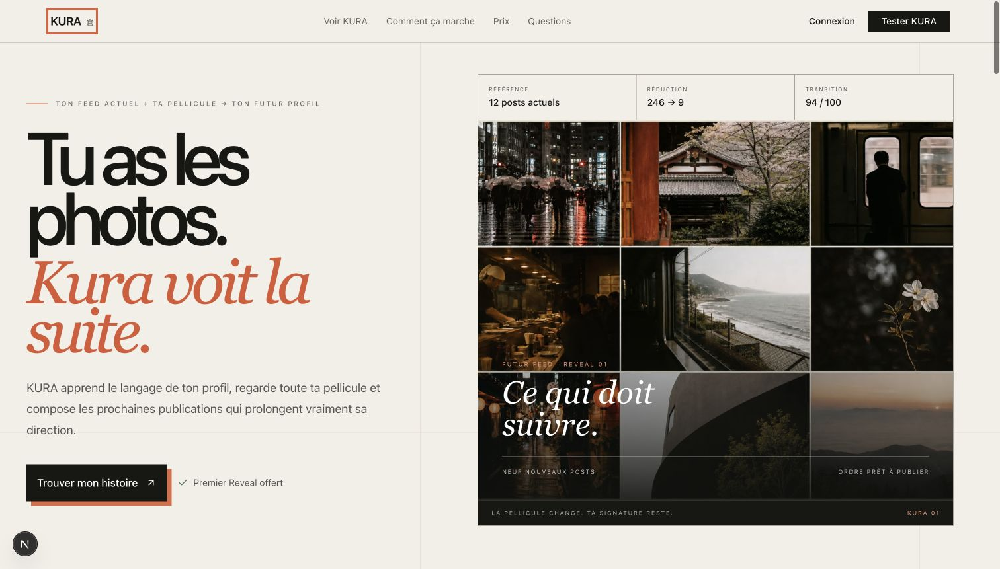
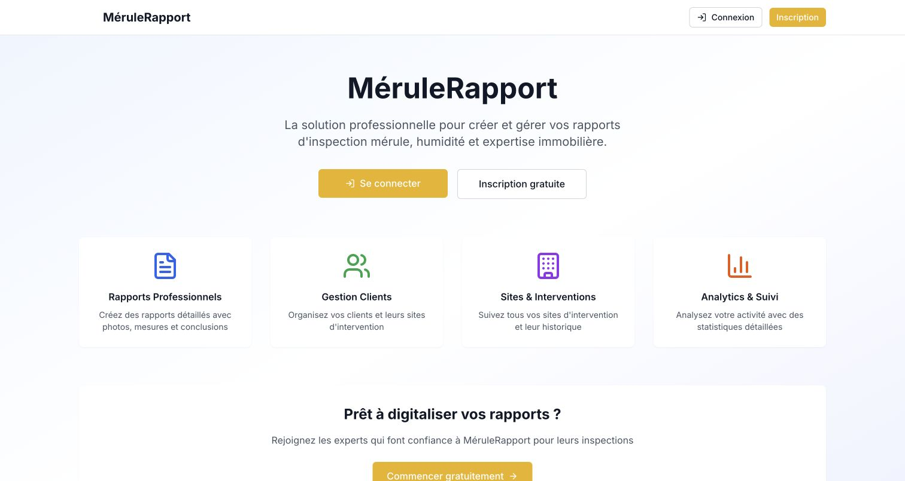

# Maxime Lespineux — Développeur Full-Stack senior

Je transforme des besoins métier en **SaaS, applications web et produits IA utilisables en production**.

Fondateur de [Maxode](https://www.maxode.com), j'accompagne startups, PME et fondateurs du cadrage à la mise en ligne : UX/UI, architecture, développement, paiements, sécurité, déploiement et documentation.

## Ce que mes clients peuvent vérifier

- **28+ projets livrés** et **7+ ans d'expérience**
- **5,0/5 sur 9 recommandations publiques** sur [Codeur.com](https://www.codeur.com/-maxode)
- Des [études de cas détaillées](https://www.maxode.com/projets) avec le contexte, les choix et le résultat
- Un seul interlocuteur du cadrage à la mise en production
- Le code est documenté, transmis et reste la propriété du client

## Produits et interfaces réelles

<table>
  <tr>
    <td width="33%" valign="top">
      
      <h3>KURA — Vision IA</h3>
      
Sélection et séquencement de photos à partir d'une pellicule. Pipeline testé de bout en bout sur 246 images réelles.

      <a href="https://www.maxode.com/projets/kura">Voir l'étude de cas →</a>
    </td>
    <td width="33%" valign="top">
      
      <h3>Elaia Bijoux — E-commerce</h3>
      
Boutique complète, paiement, commandes et panneau d'administration pour rendre la cliente autonome.

      <a href="https://www.maxode.com/projets/elaia-bijoux">Voir l'étude de cas →</a>
    </td>
    <td width="33%" valign="top">
      
      <h3>MéruleRapport — Application métier</h3>
      
PWA terrain pour organiser les inspections, travailler hors ligne et produire des rapports vérifiables.

      <a href="https://www.maxode.com/projets/merule-rapport">Voir l'étude de cas →</a>
    </td>
  </tr>
</table>

## Ce que je construis

- SaaS B2B multi-tenant avec authentification, rôles, abonnements et back-office
- Applications métier qui remplacent les fichiers Excel et les tâches manuelles
- Produits intégrant l'IA : traitement documentaire, analyse d'images et automatisations contrôlées
- E-commerce complet avec paiement, commandes et autonomie éditoriale
- API, intégrations tierces, PWA hors ligne et logiciels desktop

## Autres réalisations par domaine

| Domaine | Exemples | Ce que cela démontre |
|---|---|---|
| SaaS et produits B2B | Syrhm, FoodTruckGo, ShiftEase, SitePilot, Velocy, STANN | Multi-tenant, rôles, abonnements, portails clients et workflows métier |
| IA et automatisation | PropriétéIA, KURA, Avis Google, ZenRecover | IA générative, vision, validation humaine et automatisations contrôlées |
| E-commerce | Elaia Bijoux, V&A Studio | Catalogue, panier, paiement, commandes et autonomie éditoriale |
| Applications métier | MLC E-Logistics, Facadia, Audomicile Manager, Delivery Note Manager | Logistique, fichiers DWG/DXF, PDF, facturation et outils desktop |
| Terrain et offline | WoodProof, MéruleRapport | Plans, preuves photo, rapports et synchronisation hors ligne |
| Intégrations et API | Shopify-Sendcloud, EUDR Copilot | Webhooks, files de traitement, idempotence, audit et données réglementaires |

Les dépôts clients restent privés par défaut. Les réalisations sont présentées sur le [portfolio Maxode](https://www.maxode.com/projets) et sur [Codeur.com](https://www.codeur.com/-maxode/portfolio) sans publier de code, de secrets ou de données confidentielles.

## Stack principale

`TypeScript` · `Next.js` · `React` · `Node.js` · `Python` · `FastAPI` · `Flutter` · `PostgreSQL` · `Supabase` · `Stripe` · `Docker` · `Vercel`

## Ma façon de travailler

1. Clarifier le problème, les utilisateurs et le résultat attendu.
2. Définir un périmètre livrable et une architecture maintenable.
3. Montrer régulièrement l'avancement pour éviter les mauvaises surprises.
4. Tester, documenter, déployer et transmettre un produit que le client possède.

Vous avez un SaaS à lancer, une application à reprendre ou un processus à automatiser ? [Parlons du projet pendant 30 minutes](https://cal.eu/maxode/30min).
