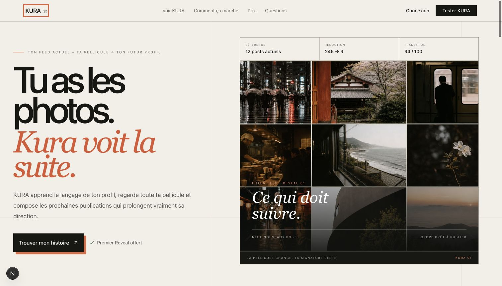
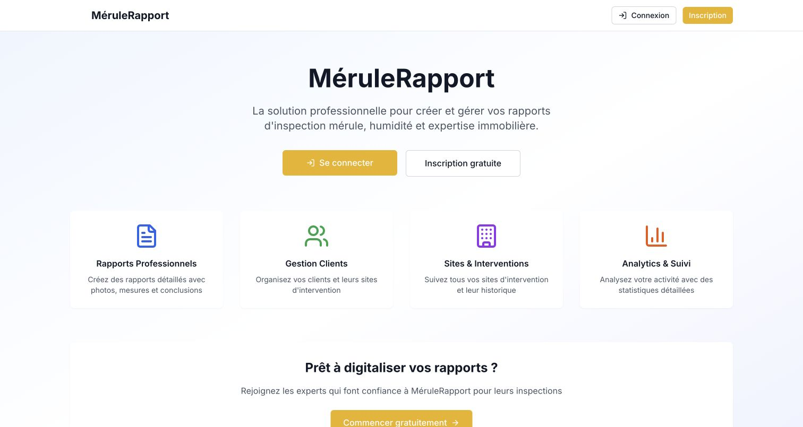

# Maxime Lespineux

### Développeur Full-Stack senior · Fondateur de Maxode

Je conçois, reprends et mets en production des **SaaS**, **applications métier**, **API** et **fonctionnalités IA**.

## Ce que je prends en charge

- **Lancement** : transformer un besoin métier en MVP puis en produit exploitable.
- **Reprise** : diagnostiquer un projet bloqué, corriger les points critiques et reprendre les livraisons.
- **Intégration** : connecter paiements, services tiers, webhooks, données et automatisations.
- **Production** : architecture, sécurité, tests, déploiement, observabilité et documentation.

Je travaille avec des fondateurs, PME et agences qui recherchent un interlocuteur technique unique, capable de comprendre le produit autant que le code.

## Réalisations sélectionnées

<table>
  <tr>
    <td width="33%" valign="top">
      
      <h3>KURA · Vision IA</h3>
      
Analyse et sélection d'images, classement, séquencement et validation humaine dans une interface produit complète.

      <a href="https://www.maxode.com/projets/kura">Voir l'étude de cas →</a>
    </td>
    <td width="33%" valign="top">
      
      <h3>Elaia Bijoux · E-commerce</h3>
      
Catalogue, panier, paiement, commandes et administration réunis dans une boutique exploitée en autonomie.

      <a href="https://www.maxode.com/projets/elaia-bijoux">Voir l'étude de cas →</a>
    </td>
    <td width="33%" valign="top">
      
      <h3>MéruleRapport · Logiciel métier</h3>
      
PWA terrain, fonctionnement hors ligne, preuves photo et génération de rapports structurés.

      <a href="https://www.maxode.com/projets/merule-rapport">Voir l'étude de cas →</a>
    </td>
  </tr>
</table>

## Produits et systèmes développés

| Projet | Type | Briques techniques principales |
|---|---|---|
| **SYRHM** | SaaS métier | Authentification, rôles, workflows, données et administration |
| **STANN** | Logiciel d'exploitation | Clients, interventions, stocks, facturation et tableaux de bord |
| **MLC E-Logistics** | ERP logistique | Multi-tenant, PostgreSQL, RLS, synchronisation Sendcloud et facturation |
| **EUDR Copilot** | Outil de conformité | Ingestion de données, normalisation, audit et automatisations |
| **XPERFO** | Logiciel desktop | Distribution de versions, manifestes et vérification SHA-256 des mises à jour |
| **KURA** | Produit IA | Traitement d'images, scoring, recommandations et validation humaine |

La majorité des dépôts clients reste privée. Je présente les fonctionnalités, décisions d'architecture et interfaces autorisées sans publier de secrets, de données personnelles ni de code confidentiel.

## Dépôts publics utiles

- [MLC E-Logistics Inventory Pilot](https://github.com/Sqch02/mlc-elogistics-inventory-pilot) — application logistique multi-tenant avec synchronisation Sendcloud.
- [STANN Frontend](https://github.com/Sqch02/stann_app_frontend) — interface React/TypeScript pour une application de gestion opérationnelle.
- [XPERFO Releases](https://github.com/Sqch02/XPERFO-Releases) — mécanisme public de distribution et de vérification des mises à jour.
- [Calendrier Prodige](https://github.com/Sqch02/calendrier_prodige) — calendrier d'entreprise React, Node.js et MongoDB.

## Stack principale

`TypeScript` · `Next.js` · `React` · `Node.js` · `NestJS` · `Python` · `FastAPI` · `Flutter` · `PostgreSQL` · `Supabase` · `Redis` · `Stripe` · `Docker` · `Vercel`

## Méthode de travail

1. Cadrer le besoin, les utilisateurs et le résultat attendu.
2. Définir un périmètre livrable et une architecture maintenable.
3. Montrer régulièrement l'avancement sur un environnement de démonstration.
4. Tester, documenter, déployer et transmettre un produit que le client maîtrise.

**28+ projets livrés · 7+ ans d'expérience · 5/5 sur 9 avis vérifiés**

Vous avez un produit à lancer, une application à reprendre ou un processus à automatiser ?  
[Réserver un échange de 30 minutes](https://cal.eu/maxode/30min) · [Voir les réalisations Maxode](https://www.maxode.com/projets)
